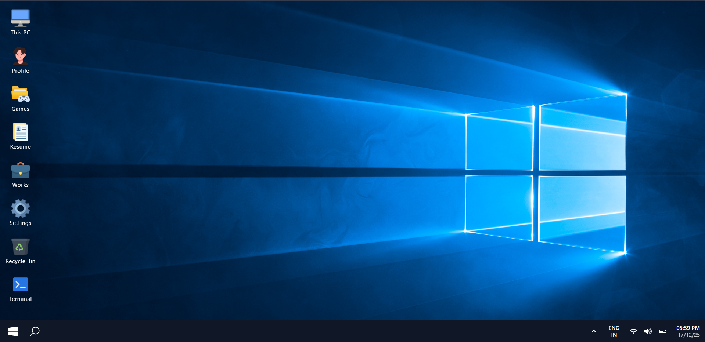

# Portfolio Windows Theme


A unique personal portfolio website designed with a Windows OS-inspired interface, built using modern web technologies. This interactive portfolio showcases projects, skills, and professional experience in an engaging, desktop-like environment.

## 🚀 Features

- **Windows-like Desktop Interface**: Complete desktop experience with taskbar, windows, and icons
- **Interactive Components**:
  - Boot screen animation
  - Draggable and resizable windows
  - Start menu with navigation
  - Desktop icons for quick access
- **Portfolio Sections**:
  - About Me
  - Projects showcase
  - Skills and technologies
  - Contact information
  - Resume download
- **Games Section**: Built-in mini-games (Memory Game, Tic-Tac-Toe, Number Guessing)
- **Terminal Emulator**: Interactive command-line interface
- **Customization Options**:
  - Multiple wallpaper choices
  - Persistent user preferences
- **Responsive Design**: Works across different screen sizes
- **Analytics Integration**: Vercel Analytics for visitor tracking

## 🛠️ Tech Stack

- **Frontend Framework**: React 19
- **Build Tool**: Vite
- **Styling**: Tailwind CSS 4
- **Icons**: React Icons
- **Analytics**: Vercel Analytics
- **Deployment**: vercel.com

## 📦 Installation

1. Clone the repository:
```bash
git clone https://github.com/thomas-chacko/Portfolio-Windows-Theme
cd portfolio-window-theme
```

2. Install dependencies:
```bash
npm install
```

3. Start the development server:
```bash
npm run dev
```

4. Open your browser and navigate to `http://localhost:5173`

## 🚀 Deployment

The site will be deployed to `https://thomaschacko.vercel.app/` (or your configured domain).

### Other Platforms
The built files in the `dist` folder can be deployed to any static hosting service like Netlify, Vercel, or GitHub Pages.

## 📁 Project Structure

```
portfolio-window-theme/
├── public/
├── src/
│   ├── assets/
│   │   └── images/
│   ├── components/
│   │   ├── BootScreen.jsx
│   │   ├── Desktop.jsx
│   │   ├── DesktopIcon.jsx
│   │   ├── GameCenter.jsx
│   │   ├── RecycleBinContent.jsx
│   │   ├── StartMenu.jsx
│   │   ├── Taskbar.jsx
│   │   ├── Terminal.jsx
│   │   ├── WindowModal.jsx
│   │   ├── WorksContent.jsx
│   │   └── games/
│   │       ├── MemoryGame.jsx
│   │       ├── NumberGuessing.jsx
│   │       └── TicTacToe.jsx
│   ├── data/
│   │   ├── projects.js
│   │   └── wallpapers.js
│   ├── App.jsx
│   ├── index.css
│   ├── main.jsx
│   └── index.html
├── package.json
├── vite.config.js
├── tailwind.config.js
├── eslint.config.js
└── README.md
```
## 🤝 Contributing

1. Fork the repository
2. Create your feature branch (`git checkout -b feature/AmazingFeature`)
3. Commit your changes (`git commit -m 'Add some AmazingFeature'`)
4. Push to the branch (`git push origin feature/AmazingFeature`)
5. Open a Pull Request

## 👨‍💻 Author

**Thomas Chacko**
- Portfolio: [thomaschacko.vercel.app](https://thomaschacko.vercel.app/)
- GitHub: [@thomas-chacko](https://github.com/thomas-chacko)
- Email: [thomaschacko180@gmail.com]

⭐ If you like this project, please give it a star on GitHub!